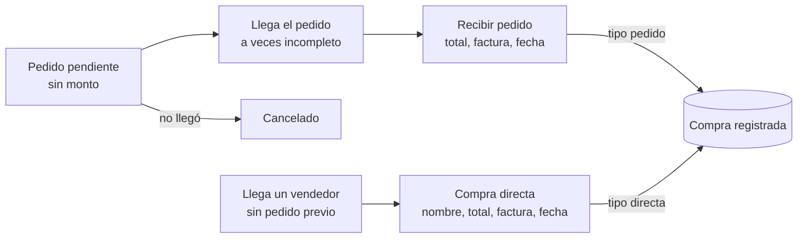

# Plan de implementación — Sistema POS para tiendas

> Documento de referencia para implementar el sistema. Implementar **una fase a la vez** (ver "Fases de implementación") y detenerse al final de cada fase para revisión.

## Resumen y alcance

Un solo proyecto Nuxt 4 (interfaz + API en Nitro) para las dos tiendas: un catálogo de productos compartido, stock separado por tienda, ventas tipo POS con turnos y corte de caja, entradas de inventario, pedidos y compras, y reportes por día, mes y año. Hay dos roles: **admin** y **vendedora**.

Módulos de la versión 1:

- **Ventas (POS):** turnos de caja, carrito, cobro, ticket imprimible, anulación y corte de caja.
- **Inventario:** productos con categoría y foto opcionales, unidad de medida (unidad, libra, litro), stock por tienda, entradas, ajustes y un historial de movimientos (kardex).
- **Pedidos y compras:** pedidos como recordatorio sin total; compras con total, factura y fecha, con o sin pedido previo, pagadas o no con efectivo de la caja.
- **Reportes:** ventas, compras, cortes de caja y resumen por tienda y por periodo.
- **Administración:** tiendas, usuarios, asignación de tiendas y categorías.

Fuera de la versión 1: integración con la terminal POS, facturación electrónica (DTE), descuentos, devoluciones parciales y trabajo sin conexión.

## Reglas generales (aplican a todo el código)

- **Dinero en centavos enteros** (`integer`). Se formatea como USD solo en la interfaz.
- **Cantidades en `numeric(12,3)`** (hay productos por libra o litro). Las sumas de stock se hacen en SQL.
- **Zona horaria `America/El_Salvador`**: fechas en `timestamptz`; los reportes agrupan con `AT TIME ZONE 'America/El_Salvador'`.
- **El servidor nunca confía en precios, totales ni tienda enviados por el cliente**: los recalcula o los valida contra la base.
- Toda operación que toque stock o caja va en **una transacción**.
- No inventar nombres de componentes, props ni APIs: consultar los MCP de Nuxt UI, Better Auth y Unovis, o la documentación oficial.

## Stack y base del proyecto

Se parte de la estructura del repo [fiestas-patronales](https://github.com/divan1319/fiestas-patronales) y se reutiliza casi toda la base.

| Pieza | Qué se hace | Origen |
| --- | --- | --- |
| `app/assets/css/main.css` | Copiar tal cual: IBM Plex Sans/Mono, radios de 2 px, paleta Carbon Blue (`#0f62fe` como `blue-500`) | fiestas-patronales |
| `app/app.config.ts` | Copiar `primary: 'blue'`, `neutral: 'zinc'` y tamaño `sm`; agregar el mismo `defaultVariants` para `inputNumber`, `inputMenu`, `selectMenu` y `textarea` | fiestas-patronales, ampliado |
| `nuxt.config.ts` | Copiar módulos, fuentes y transiciones; declarar en `runtimeConfig` las variables de base de datos y storage | fiestas-patronales, ampliado |
| `server/db/index.ts` | Copiar: `Pool` de `@neondatabase/serverless` + `drizzle-orm/neon-serverless` (este driver permite transacciones) | fiestas-patronales |
| `server/utils/auth.ts` | Reemplazar el campo `role` manual por el plugin `admin()` de Better Auth y desactivar el registro público: solo existe `/login` y el admin crea las cuentas | Nuevo |
| `server/utils/session.ts` | Copiar `requireUserSession`; agregar `requireAdmin` y `requireTienda` | Ampliado |
| `server/storage/*` | Reutilizar la interfaz `StorageDriver` con un `S3StorageDriver` para el storage S3 de Neon (bucket `assets`) | Ampliado |
| Gráficas de reportes | `@unovis/vue` | Nuevo |
| Drizzle Kit | Mismos scripts `db:generate`, `db:migrate`, `db:seed` | fiestas-patronales |

### Storage de archivos (Neon, compatible con S3)

- Dependencias: `@aws-sdk/client-s3` y `@aws-sdk/s3-request-presigner`. `dotenv` solo en los scripts de `tsx` (seed, crear admin); Nuxt ya carga `.env` en desarrollo.
- `S3StorageDriver` implementa `save`, `url` y `delete` con `PutObjectCommand`, `getSignedUrl` + `GetObjectCommand` y `DeleteObjectCommand`, sobre un `S3Client({ forcePathStyle: true })`.
- En la base se guarda solo la key (por ejemplo `productos/<id>/<uuid>.webp` o `comprobantes/<tiendaId>/<uuid>.pdf`), nunca la URL firmada.
- Subida: el archivo pasa por un endpoint de Nitro (`readMultipartFormData`) que valida tipo y tamaño antes del `PutObjectCommand`.
- Lectura: `GET /api/files/[...key]` exige sesión, genera una URL firmada corta y responde con redirección 302.
- Configuración: leer endpoint, región, credenciales y bucket en `runtimeConfig` y pasarlos explícitos al `S3Client`, para que el error sea claro si faltan.

Referencia del snippet de Neon:

```ts
import { S3Client, PutObjectCommand, GetObjectCommand } from "@aws-sdk/client-s3";
import { getSignedUrl } from "@aws-sdk/s3-request-presigner";

const s3 = new S3Client({ forcePathStyle: true });
const bucket = "assets";
const key = "uploads/file.txt";

await s3.send(new PutObjectCommand({ Bucket: bucket, Key: key, Body: "Hello World!" }));
const url = await getSignedUrl(s3, new GetObjectCommand({ Bucket: bucket, Key: key }), { expiresIn: 3600 });
```

A verificar: el nombre exacto de la opción para desactivar el registro en Email & Password de Better Auth.

## Roles, permisos y tienda activa

Los usuarios los crea el admin con el plugin `admin` de Better Auth (`createUser`, `setRole`, `setUserPassword`, `banUser`), con dos roles: `admin` y `vendedora`. La autorización del dominio va en helpers propios de Nitro, sin una capa de permisos extra.

| Acción | Admin | Vendedora |
| --- | --- | --- |
| Abrir y cerrar su turno de caja | Sí | Sí, en su tienda activa |
| Vender y ver sus ventas del turno | Sí, en cualquier tienda | Sí, en su tienda activa |
| Anular una venta | Sí | No |
| Registrar salidas de efectivo de un turno | Sí | No (las ve en su turno) |
| Ver cortes de caja | Todos | Solo los suyos |
| Ver productos y stock | Todas las tiendas | Su tienda activa |
| Crear o editar productos, precios y categorías | Sí | No |
| Registrar entradas de inventario | Sí | No |
| Ajustar stock (conteo, merma, vencido) | Sí | No |
| Crear pedidos y registrar compras | Sí | No |
| Ver reportes | Todas las tiendas o una | No |
| Gestionar usuarios y tiendas | Sí | No |

### Asignación de tiendas y tienda activa

- Tabla `usuario_tienda` (`user_id`, `tienda_id`): el admin asigna una o varias tiendas a cada vendedora.
- Campo adicional `tiendaActivaId` en `user` (vía `user.additionalFields`, con `input: false`), guardado en la base para que la elección se mantenga entre dispositivos.
- Al iniciar sesión: con una sola tienda asignada se fija automáticamente; con varias y sin tienda activa, se muestra un selector obligatorio.
- Un selector en la barra superior permite cambiarla (`PUT /api/me/tienda-activa`); el servidor valida que la tienda esté asignada al usuario.
- El admin ve todas las tiendas y puede elegir "Todas" en reportes y listados.

Helpers de Nitro:

- `requireAdmin(event)`: sesión válida y rol `admin`.
- `requireTienda(event)`: devuelve la tienda activa del usuario y confirma que sigue asignada; las rutas de venta, stock y caja la usan en lugar de aceptar un `tiendaId` del cliente (el admin sí puede enviarlo).

## Modelo de datos

El catálogo es único y el stock vive en `stock_tienda`, una fila por tienda y producto. Cada cambio de stock escribe un movimiento en `movimiento_inventario` dentro de la misma transacción. Las tablas de Better Auth (`user`, `session`, `account`, `verification`) se generan como en fiestas-patronales, más los campos del plugin `admin` y `tiendaActivaId`.

| Tabla | Columnas principales | Notas |
| --- | --- | --- |
| `tienda` | `id`, `nombre`, `direccion`, `activa`, `ultimo_correlativo` | `ultimo_correlativo` numera las ventas por tienda |
| `usuario_tienda` | `user_id`, `tienda_id` | PK compuesta |
| `categoria` | `id`, `nombre`, `activa` | |
| `producto` | `id`, `nombre`, `codigo_barras` (único, opcional), `categoria_id` (opcional), `unidad_medida`, `precio_venta_centavos`, `foto_key` (opcional), `activo` | `unidad_medida`: `unidad`, `libra`, `litro`; el precio es por esa unidad. Mismo precio en todas las tiendas |
| `stock_tienda` | `tienda_id`, `producto_id`, `cantidad` `numeric(12,3)`, `stock_minimo` `numeric(12,3)` (opcional) | PK compuesta; `cantidad` puede quedar negativa |
| `movimiento_inventario` | `id`, `tienda_id`, `producto_id`, `tipo`, `cantidad` `numeric(12,3)` (con signo), `referencia_tipo`, `referencia_id`, `user_id`, `nota`, `created_at` | `tipo`: `entrada`, `venta`, `anulacion_venta`, `ajuste` |
| `entrada_inventario` | `id`, `tienda_id`, `user_id`, `nota`, `created_at` | Separada de la compra |
| `entrada_inventario_detalle` | `entrada_id`, `producto_id`, `cantidad` `numeric(12,3)` | |
| `pedido` | `id`, `tienda_id`, `nombre`, `proveedor` (opcional), `fecha_esperada`, `estado`, `nota`, `user_id`, `created_at` | Sin total; `estado`: `pendiente`, `recibido`, `cancelado` |
| `compra` | `id`, `tienda_id`, `tipo`, `pedido_id` (único, opcional), `nombre`, `proveedor` (opcional), `total_centavos`, `numero_factura` (opcional), `comprobante_key` (opcional), `fecha_compra`, `user_id`, `created_at` | `tipo`: `pedido` o `directa` |
| `turno_caja` | `id`, `tienda_id`, `user_id`, `abierto_at`, `monto_inicial_centavos`, `cerrado_at`, `efectivo_esperado_centavos`, `efectivo_contado_centavos`, `diferencia_centavos`, `nota` | Esperado y diferencia se calculan y guardan al cerrar |
| `salida_caja` | `id`, `turno_id`, `tienda_id`, `user_id` (admin), `monto_centavos`, `motivo`, `compra_id` (único, opcional), `created_at` | Efectivo que sale del turno; `compra_id` cuando paga una compra |
| `venta` | `id`, `tienda_id`, `turno_id`, `correlativo`, `user_id`, `total_centavos`, `metodo_pago`, `monto_recibido_centavos`, `cambio_centavos`, `estado`, `con_stock_insuficiente`, `anulada_por`, `motivo_anulacion`, `created_at` | Único (`tienda_id`, `correlativo`) |
| `venta_detalle` | `venta_id`, `producto_id`, `nombre_producto`, `unidad_medida`, `precio_unitario_centavos`, `cantidad` `numeric(12,3)`, `subtotal_centavos` | Guarda nombre, unidad y precio del momento de la venta |

Reglas en la base:

- `CHECK` en `compra`: si `tipo = 'pedido'`, `pedido_id` no puede ser nulo; si es `directa`, debe ser nulo.
- `pedido_id` único en `compra`: un pedido se recibe una sola vez.
- Un solo turno abierto por usuario y tienda: índice único parcial en `turno_caja (tienda_id, user_id) WHERE cerrado_at IS NULL`.
- `salida_caja`: `CHECK (monto_centavos > 0)`, `motivo` no nulo y `compra_id` único.
- Índices para reportes: `venta (tienda_id, created_at)`, `venta (turno_id)`, `salida_caja (turno_id)`, `compra (tienda_id, fecha_compra)`, `turno_caja (tienda_id, abierto_at)`, `movimiento_inventario (tienda_id, producto_id, created_at)`.
- Descuento de stock sin bloqueo: `INSERT INTO stock_tienda (tienda_id, producto_id, cantidad) VALUES ($t, $p, -$q) ON CONFLICT (tienda_id, producto_id) DO UPDATE SET cantidad = stock_tienda.cantidad - $q RETURNING cantidad`. Si el resultado es negativo, la venta se guarda con `con_stock_insuficiente = true`.

Cantidades con decimales:

- Todas las cantidades usan `numeric(12,3)`: hasta tres decimales (por ejemplo, 1.250 lb).
- Si `unidad_medida = 'unidad'`, el servidor rechaza cantidades con decimales; para `libra` y `litro` acepta hasta tres decimales. Siempre mayores que cero.
- Subtotal de línea: `round(precio_unitario_centavos × cantidad)` en el servidor; el total es la suma de los subtotales ya redondeados.
- Drizzle devuelve `numeric` como string por defecto: usar un helper único para convertir y validar cantidades (Zod con máximo tres decimales). Verificar en la documentación de Drizzle si `numeric` acepta un modo que devuelva `number`.

## Flujo de ventas (POS)

Toda venta ocurre dentro de un turno de caja abierto. El servidor registra la venta en una sola transacción; si falta stock, se advierte pero se permite vender.

1. Al entrar a `/pos`, si el usuario no tiene turno abierto en la tienda activa, se le pide el efectivo inicial para abrirlo.
2. La pantalla carga los productos activos con el stock de la tienda activa.
3. La vendedora busca por nombre o código de barras (un lector USB escribe como teclado en el campo de búsqueda), o toca el producto en la cuadrícula. Si el producto se vende por libra o litro, al agregarlo se pide la cantidad (por ejemplo, 1.5 lb).
4. El carrito muestra cantidad editable (con decimales solo en productos por libra o litro), la unidad, el subtotal por línea y el total; el ticket imprime, por ejemplo, 1.500 lb × $0.80. Si una cantidad supera el stock registrado, la línea muestra una advertencia.
5. "Cobrar" abre un modal: método de pago (efectivo, tarjeta, transferencia), monto recibido y cambio. Si hay líneas sin stock suficiente, el modal repite la advertencia: la venta se puede hacer, pero hay que actualizar el stock después.
6. Al confirmar, el cliente envía solo `[{ productoId, cantidad }]`, `metodoPago` y `montoRecibido`.
7. El servidor, en una transacción:
   1. Obtiene la tienda con `requireTienda` y el turno abierto del usuario; sin turno, rechaza la venta.
   2. Lee precios y unidad actuales desde `producto`, valida las cantidades y calcula el total.
   3. Incrementa `tienda.ultimo_correlativo` con `UPDATE … RETURNING`.
   4. Inserta `venta` (con `turno_id`) y `venta_detalle`.
   5. Descuenta stock con el upsert atómico y escribe un movimiento `venta` por línea; si algún saldo queda negativo, marca `con_stock_insuficiente`.
8. Se muestra el ticket con el correlativo y se imprime con `window.print()` y una hoja de estilos de impresión.

Anulación (solo admin): pide motivo, cambia `estado` a `anulada`, devuelve el stock y escribe movimientos `anulacion_venta`. La venta no se borra, y los reportes excluyen las anuladas.

### Corte de caja

Cada turno pertenece a un usuario y una tienda; al cerrarlo, el sistema compara el efectivo esperado con el contado.

1. **Abrir turno:** se registra el efectivo inicial en la tienda activa.
2. **Durante el turno:** la vendedora ve en `/caja` sus ventas del turno, el total por método de pago, las salidas de efectivo y el efectivo esperado hasta el momento.
3. **Salidas de efectivo (solo admin):** cuando se paga algo con dinero de la caja, el admin registra la salida en el turno abierto de esa tienda, con monto y motivo, desde la compra o suelta (por ejemplo, un gasto menor).
4. **Cerrar turno:** la vendedora cuenta el efectivo y lo ingresa, con una nota opcional. El servidor calcula el esperado como efectivo inicial + ventas en efectivo completadas − salidas del turno, y guarda esperado, contado y diferencia. Las ventas anuladas no suman.
5. **Después:** el turno cerrado queda de solo lectura, se puede imprimir su resumen y el admin lo ve en el reporte de cortes.

Validaciones de las salidas, en el servidor y dentro de una transacción:

- Solo el admin puede registrarlas.
- El turno debe existir, pertenecer a la tienda indicada y estar abierto.
- El monto debe ser mayor que cero y no puede superar el efectivo esperado actual del turno. El esperado se recalcula con el turno bloqueado (`SELECT … FOR UPDATE`).
- El motivo es obligatorio.
- Una compra solo puede tener una salida asociada (`compra_id` único), y su monto debe ser igual al total de la compra.
- Si hay varios turnos abiertos en la tienda, el admin elige de cuál sale el efectivo; si solo hay uno, se preselecciona.

## Inventario

El stock solo cambia por cuatro vías: entradas, ventas, anulaciones y ajustes; cada una escribe su movimiento.

- **Productos (admin):** nombre, unidad de medida, precio de venta, código de barras, categoría y foto opcionales. Se desactivan en lugar de borrarse.
- **Categorías (admin):** CRUD simple; un producto sin categoría aparece como "Sin categoría".
- **Entradas de inventario (admin):** se elige la tienda, se agregan líneas producto + cantidad y se guarda. En una transacción se crea la entrada, se hace upsert en `stock_tienda` (`INSERT … ON CONFLICT (tienda_id, producto_id) DO UPDATE SET cantidad = stock_tienda.cantidad + EXCLUDED.cantidad`) y se escribe un movimiento `entrada` por línea.
- **Ajustes (admin):** para conteo físico, merma o vencidos, con motivo obligatorio; movimiento `ajuste`.
- **Carga inicial:** una entrada con la nota "Inventario inicial" por tienda. Importar desde CSV puede venir después.
- **Kardex:** vista por producto y tienda con los movimientos y el saldo acumulado.
- **Stock bajo:** si `stock_minimo` está definido, el producto se marca en listados y en el panel. Los productos con stock negativo aparecen aparte como "Stock por corregir" hasta que se registre una entrada o ajuste.
- **Transferencias entre tiendas:** se hacen como un ajuste de salida en una tienda y una entrada en la otra.

Las entradas no dependen de las compras. Al terminar de recibir un pedido, la interfaz puede ofrecer un botón "Registrar entrada" como atajo, sin vincular ambos registros.

## Pedidos y compras

Un pedido es solo un recordatorio sin monto; la compra es el registro con dinero. Solo el admin crea pedidos y registra compras.



- **Pedido:** nombre, proveedor opcional, tienda, fecha esperada y nota. Queda en `pendiente` y aparece en el panel como "Hoy", "Próximos" o "Atrasados" según `fecha_esperada`.
- **Recibir pedido:** formulario con el nombre ya cargado; se captura el total pagado, el número de factura, la foto o PDF del comprobante (opcional) y la fecha de registro (hoy por defecto, editable por el admin). En una transacción se crea la `compra` con `tipo = 'pedido'` y el pedido pasa a `recibido`. Si llegó incompleto, solo se registra lo que se pagó.
- **Compra directa:** nombre de lo que se compró, proveedor opcional, total, número de factura o comprobante y fecha. Se guarda con `tipo = 'directa'`.
- **Cancelar pedido:** pasa a `cancelado` sin generar compra.
- **Pago con efectivo de la caja:** al recibir un pedido o registrar una compra directa, el admin puede marcar "Pagada con efectivo de la caja" y elegir el turno abierto. En la misma transacción se crea la compra y una `salida_caja` con `compra_id` y el total, aplicando las validaciones de Corte de caja; si alguna falla, no se guarda nada.

## Reportes

Cuatro reportes con los mismos filtros (tienda o "Todas", periodo día, mes o año, y rango de fechas), calculados con SQL agregado en el servidor y graficados con `@unovis/vue`.

| Reporte | Qué muestra |
| --- | --- |
| Ventas | Total vendido, número de ventas, ticket promedio, desglose por método de pago, productos más vendidos y serie por periodo |
| Compras | Total comprado, separado en con pedido y directas, cuánto se pagó con efectivo de caja y el listado de facturas del periodo |
| Cortes de caja | Turnos por tienda y usuario con efectivo inicial, ventas en efectivo, salidas, esperado, contado y diferencia |
| Resumen | Ventas vs. compras por periodo y por tienda |

Ejemplo de agrupación por día con zona horaria local:

```sql
SELECT date_trunc('day', created_at AT TIME ZONE 'America/El_Salvador') AS dia,
       tienda_id, count(*) AS ventas, sum(total_centavos) AS total
FROM venta
WHERE estado = 'completada' AND created_at >= $desde AND created_at < $hasta
GROUP BY 1, 2 ORDER BY 1;
```

Para mes o año se cambia `'day'` por `'month'` o `'year'`. En compras se agrupa por `fecha_compra`.

Limitación: como las compras no guardan productos, "ventas menos compras" es flujo de caja, no ganancia real.

Gráficas: consultar componentes y props de `@unovis/vue` con su MCP (`claude mcp add unovis -- npx -y @unovis/mcp`) y aplicar la paleta Carbon con las variables CSS que documenten. Envolver las gráficas en `<ClientOnly>` por si no renderizan en SSR.

## API en Nitro

Rutas en `server/api/*` con la convención de fiestas-patronales (`index.get.ts`, `[id].put.ts`), validación con Zod (`readValidatedBody`, `getValidatedQuery`; confirmar firma en la versión de h3 instalada) y los helpers de sesión al inicio de cada handler.

| Método y ruta | Rol | Qué hace |
| --- | --- | --- |
| `* /api/auth/[...all]` | Público | Better Auth: inicio de sesión y endpoints del plugin `admin`; sin registro público |
| `GET /api/me/tiendas` | Ambos | Tiendas asignadas y la activa |
| `PUT /api/me/tienda-activa` | Ambos | Cambia la tienda activa, validando la asignación |
| `GET/POST/PUT /api/admin/tiendas` | Admin | CRUD de tiendas |
| `PUT /api/admin/usuarios/[id]/tiendas` | Admin | Asigna tiendas a un usuario |
| `GET /api/categorias`, `POST/PUT` | GET ambos, escritura admin | Categorías |
| `GET /api/productos` | Ambos | Búsqueda por nombre, código o categoría, con stock de la tienda |
| `POST/PUT /api/productos`, `POST /api/productos/[id]/foto` | Admin | Alta, edición y foto |
| `GET /api/files/[...key]` | Ambos | Redirige a una URL firmada del storage de Neon |
| `GET/POST /api/inventario/entradas` | Admin | Lista y registra entradas |
| `POST /api/inventario/ajustes` | Admin | Ajuste con motivo |
| `GET /api/inventario/movimientos` | Admin | Kardex por producto y tienda |
| `GET/POST /api/pedidos`, `PUT /api/pedidos/[id]` | Admin | Pedidos |
| `POST /api/pedidos/[id]/recibir` | Admin | Crea la compra y marca recibido; con `turnoId` opcional, también la salida de caja |
| `POST /api/pedidos/[id]/cancelar` | Admin | Cancela el pedido |
| `GET/POST /api/compras`, `POST /api/compras/[id]/comprobante` | Admin | Compras directas (con `turnoId` opcional para pagar con caja) y comprobantes |
| `GET /api/caja/turno-actual` | Ambos | Turno abierto del usuario en la tienda activa, con totales parciales |
| `POST /api/caja/turnos`, `POST /api/caja/turnos/[id]/cerrar` | Ambos (solo su turno) | Abre y cierra turno |
| `GET /api/caja/turnos` | Ambos | Admin: todos, con filtro `tiendaId` y `abiertos`; vendedora: los suyos |
| `POST /api/caja/turnos/[id]/salidas` | Admin | Registra una salida de efectivo suelta |
| `GET/POST /api/ventas`, `GET /api/ventas/[id]` | Ambos | Registrar venta; la vendedora solo ve las de su tienda |
| `POST /api/ventas/[id]/anular` | Admin | Anula y devuelve stock |
| `GET /api/reportes/ventas`, `/compras`, `/cortes`, `/resumen` | Admin | Query: `tiendaId`, `periodo`, `desde`, `hasta` |

## Interfaz: páginas, componentes y estilo

La administración usa el layout de dashboard de Nuxt UI; la pantalla de venta usa un layout propio a pantalla completa.

| Página | Rol | Componentes de Nuxt UI |
| --- | --- | --- |
| `/login`, `/elegir-tienda` | Ambos | `UAuthForm`, `URadioGroup`; no hay página de registro |
| `/` (panel) | Ambos | `UCard`, `UBadge`, `UTable`: ventas de hoy, pedidos de hoy y atrasados, stock bajo y por corregir |
| `/pos` | Ambos | `UInput` o `UInputMenu` (búsqueda y lector), `UInputNumber`, `UAlert` (stock insuficiente), `UModal` (abrir turno y cobro), `UKbd`, `defineShortcuts` |
| `/caja` | Ambos | `UCard` (resumen del turno), `UForm` + `UInputNumber` (cierre), `UTable` (turnos anteriores) |
| `/ventas`, `/ventas/[id]` | Ambos | `UTable`, `UPagination`, `USlideover` (detalle) |
| `/productos`, `/categorias` | Admin | `UTable`, `UForm`, `UFormField`, `USelectMenu`, `UFileUpload`, `USwitch` |
| `/inventario/entradas`, `/inventario/ajustes`, `/inventario/kardex` | Admin | `UForm`, `UInputMenu`, `UInputNumber`, `UTable` |
| `/pedidos`, `/compras` | Admin | `UTable`, `UTabs` (pendientes, recibidos, cancelados), `UModal` (recibir), `UInputDate`, `UFileUpload` |
| `/reportes` | Admin | `UTabs` (día, mes, año), `USelect`, `UInputDate`, `UTable` + gráficas de `@unovis/vue` |
| `/admin/usuarios`, `/admin/tiendas` | Admin | `UTable`, `UForm`, `UCheckboxGroup` (tiendas asignadas) |

Layouts: `UDashboardGroup` + `UDashboardSidebar` + `UDashboardPanel` + `UDashboardNavbar`, con el selector de tienda activa y `UColorModeButton` en la barra. Avisos con `useToast` y estados vacíos con `UEmpty`.

Estilo Carbon variante, igual que fiestas-patronales:

- Tokens de `main.css` y `app.config.ts` sin cambios: esquinas de 2 px, azul Carbon como `primary`, `zinc` como neutro y controles tamaño `sm`.
- IBM Plex Mono (clase `carbon-data-mono`) para precios, totales, cantidades, correlativos y fechas.
- Etiquetas de sección en mayúsculas, mono y espaciadas, y chips tipo tag con fondo azul oscuro para contadores.
- Fondos planos, bordes de 1 px y sin sombras; la acción principal en azul sólido y las secundarias en `outline` o `ghost`.
- Modo oscuro por defecto con fondo `neutral-900`.

Revisar props y slots de cada componente con el MCP de Nuxt UI (`https://ui.nuxt.com/mcp`) al implementar.

## Fases de implementación

Seis fases en orden de dependencia; cada una termina con algo que ya se puede usar o probar.

1. **Base:** proyecto Nuxt 4 con los tokens Carbon, Neon + Drizzle, Better Auth con el plugin `admin` y solo login, admin inicial por CLI, `S3StorageDriver`, tiendas, asignación de usuarios y tienda activa. Listo cuando una vendedora con dos tiendas elige una y la elección persiste.
   1. **Antes de configurar la base o el storage, pedir al usuario `DATABASE_URL` y las cuatro variables `AWS_*` del storage de Neon.** No inventar valores ni dejar valores de ejemplo en `.env`.
   2. `BETTER_AUTH_SECRET` se genera localmente y `BETTER_AUTH_URL` toma la URL de desarrollo o de producción.
2. **Catálogo e inventario:** categorías, productos con unidad de medida y foto, `stock_tienda`, entradas, ajustes, kardex y carga inicial. Listo cuando el stock de ambas tiendas coincide con un conteo físico.
3. **Ventas y caja:** turnos de caja, pantalla POS con advertencia de stock y cantidades decimales, transacción con correlativo, ticket imprimible, historial, anulación, salidas de efectivo y corte de caja. Listo cuando una venta descuenta el stock correcto, una anulación lo devuelve y el cierre de turno cuadra el efectivo. Incluir pruebas del cálculo de subtotales, del efectivo esperado y de las salidas.
4. **Pedidos y compras:** pedidos con fecha esperada, recepción con total y factura, compras directas, pago con efectivo de caja y comprobantes en el storage. Listo cuando el panel muestra los pedidos del día.
5. **Reportes:** ventas, compras, cortes y resumen por día, mes y año, por tienda y en conjunto, con gráficas de `@unovis/vue`. Listo cuando los totales cuadran con una consulta manual.
6. **Ajustes finales:** alertas de stock bajo y exportar a CSV.

`.env.example` (sin valores reales):

```bash
# Neon Postgres
DATABASE_URL=""

# Better Auth
BETTER_AUTH_SECRET=""
BETTER_AUTH_URL="http://localhost:3000"

# Storage S3-compatible de Neon (generar una credencial para key ID y secret)
AWS_ENDPOINT_URL_S3=""
AWS_ACCESS_KEY_ID=""
AWS_SECRET_ACCESS_KEY=""
AWS_REGION="us-east-2"
S3_BUCKET="assets"
```

## Decisiones cerradas

| Tema | Decisión |
| --- | --- |
| Registro de entradas, pedidos y compras | Solo el admin |
| Precio por tienda | Mismo precio en todas las tiendas |
| Productos a granel | Sí, por libra o litro; cantidades con hasta tres decimales |
| Stock negativo | Se permite vender, con advertencia para actualizar el stock después |
| Corte de caja | Entra en la versión 1 |
| Compras pagadas con efectivo de la caja | Sí pasa; se registran como salidas del turno con validaciones |
| Transferencias entre tiendas | Ajuste de salida en una tienda y entrada en la otra |
| Terminal POS | Se define después; por ahora el ticket se imprime desde el navegador |
| Facturación electrónica (DTE) | Se implementa después |

## Fuentes consultadas

- [Repositorio fiestas-patronales](https://github.com/divan1319/fiestas-patronales)
- [Better Auth: plugin Admin](https://better-auth.com/docs/plugins/admin)
- [Nuxt UI MCP](https://ui.nuxt.com/mcp)(claude mcp add --transport http nuxt-ui https://ui.nuxt.com/mcp)
- [Better Auth MCP](https://better-auth.com/docs/ai-resources/mcp)
- [Nuxt MCP](https://nuxt.com/mcp) (claude mcp add --transport http nuxt https://nuxt.com/mcp
)
- [Unovis MCP](claude mcp add unovis -- npx -y @unovis/mcp)